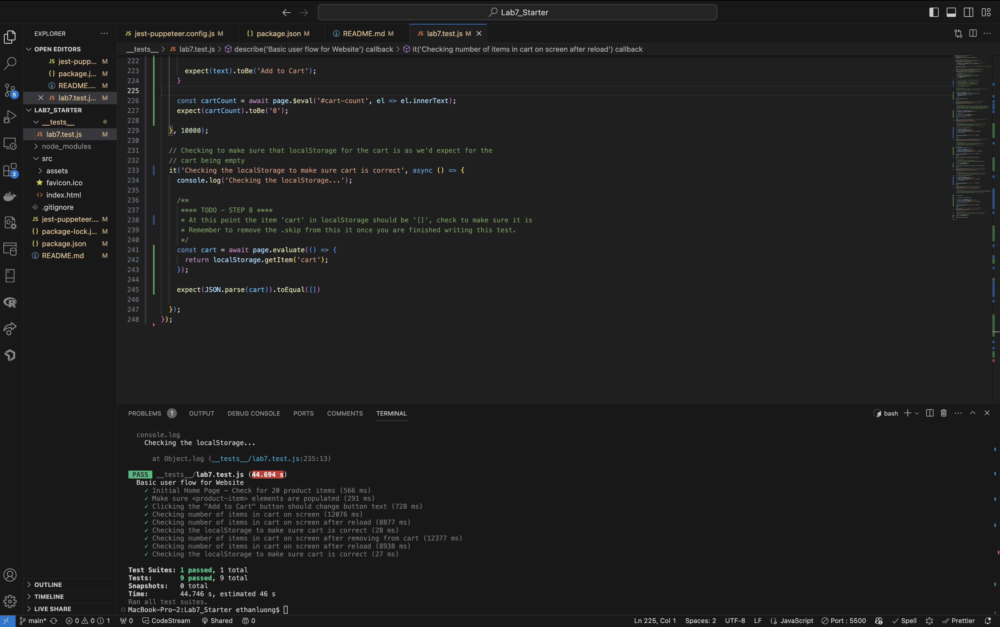

1. Where would you fit your automated tests in your Recipe project development pipeline? Select one of the following and explain why.  
 
It should be within a Github action. Option 2 can lead to many errors and overlooking bugs as it relies on the engineer. Option 3 would be extremely time consuming. Option one is the best option as well, having it in github actions allows test to be ran automatically. This makes sure whenever code is pushed, it is tested and gives us the chance to prevent merging broken features. This make it essential for rapid development allowing us to catch bugs early and ensure quality standards.

1. Would you use an end to end test to check if a function is returning the correct output? (yes/no)  
No, it is best to use a unit test.

1. What is the difference between navigation and snapshot mode?
   Navigation analyzes a page right after it loads. This means it gives an overall performance but it cannot see changes or interactions in content.
   A Snapshot shows the page at its current state which can be helpful for finding accessability issues. It cannot analyze JS performance or changes to DOM either.

2. Name three things we could do to improve the CSE 110 shop site based on the Lighthouse results.
   We could preload largest contentful paint image, properly size the images, and use a viewport.
    - We could properly size the images, as some of the images are too big for small screens.
    - We can use a viewport for mobile experience.
    - We can also preload the largest contentful paint image for faster loading times.

## Expose Screenshot

